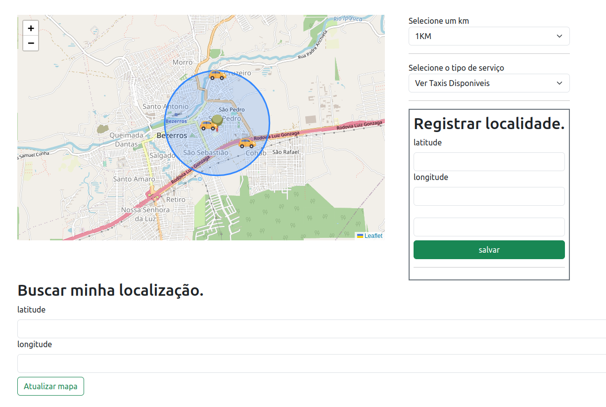
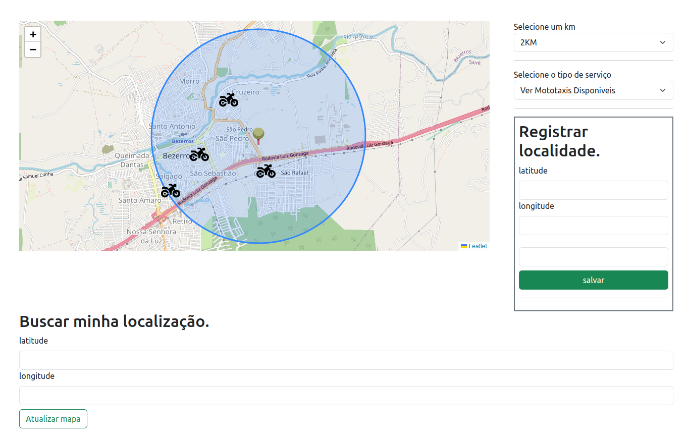
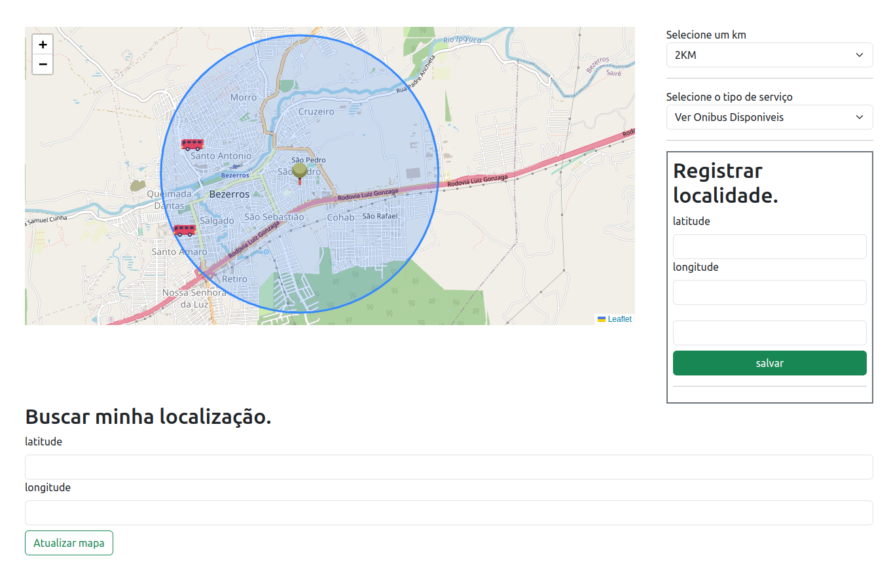

Ao longo do curso **RU101: Introdução a Estruturas de Dados do Redis**, na [Redis University](https://university.redis.com), 
pude conhecer o tipo de dado [Geospatial](https://redis.io/docs/data-types/geospatial/), onde permite guardar a localização de MEMBROS, agrupando-os em CHAVES do tipo Geo.

O Geo é um tipo de dado muito poderoso;

e como, na startup que trabalhei, precisei lidar com localização (porém a fazia usando um calculo via sql)
me surgiu alguns insights de como eu poderia começar a colocar a mão na massa, praticando com esse tipo de dado.

Juntei esse conhecimento ao meu conhecimento de Javascript e Websocket, e resolvi fazer um mapa interativo, utilizando a biblioteca [Leaflet](https://leafletjs.com/), que busca as localizações proxima a determinado ponto do mapa, num raio de X km.

Nessa versão inicial, trabalhei com 4 tipos de dados exemplo para visualização, sendo eles: Taxis, Mototaxis, Onibus e Lojas, simulando que estão disponiveis/abertos.

O localização do usuario é obtida pela API Navigator do browse, e em caso de falha, o usuario poderá informar a localização **(LAT e LNG)** dele nos campos, e em seguida atualizar o mapa, com a localização inserida

O icone do marcador possui propriedade draggable. `O que significa que da pra arrastar`

O usuario poderá escolher um raio de (inicialmente, 1, 2, 20 e 50 KM), 
o que ele deseja visualizar

**Exemplo da localização de taxis**

**Exemplo da localização de mototaxis**

**Exemplo da localização de onibus**

